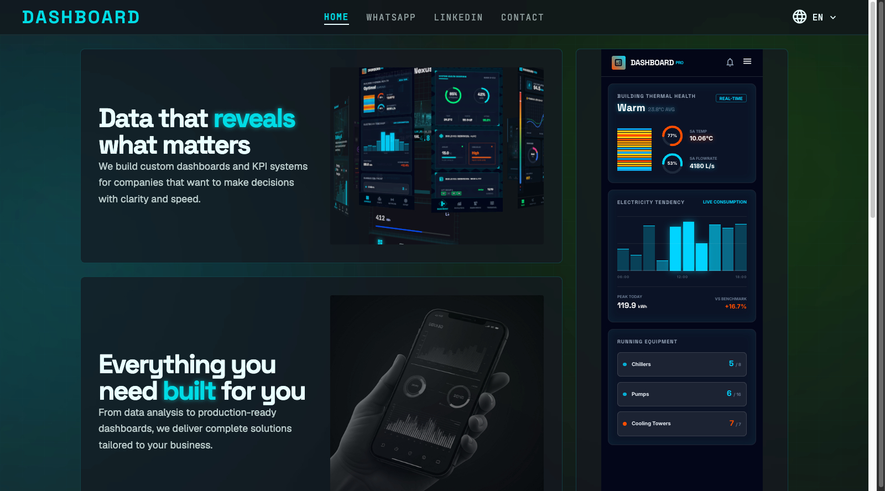
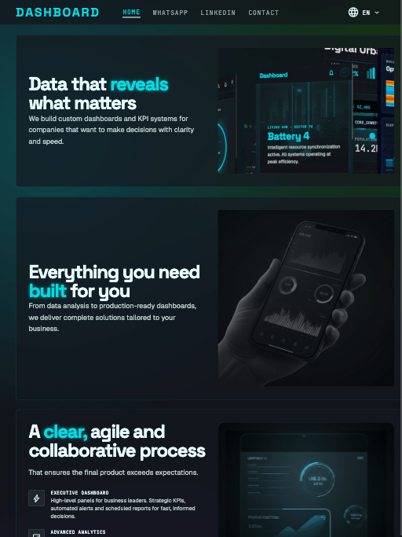
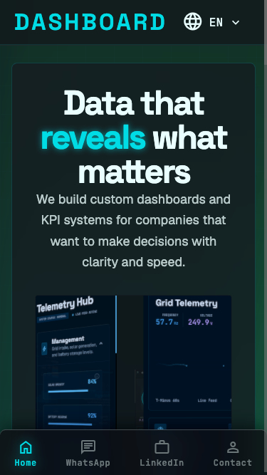

# Dashboard

It's a website template I created but a didn't like :(

Dashboard app for centralized information management tools designed to track, analyze, and display Key Performance Indicators (KPIs), metrics, and visual data for businesses or personal accounts. 

# Create Nextjs Project

```
-- Create Nextjs Project

npx create-next-app@15 .

✔ Would you like to use TypeScript? … No
✔ Which linter would you like to use? › None
✔ Would you like to use Tailwind CSS? … No
✔ Would you like your code inside a `src/` directory? … Yes
✔ Would you like to use App Router? (recommended) … Yes
✔ Would you like to use Turbopack? (recommended) … No
? Would you like to customize the import alias (`@/*` by default)? › No

-- Components

-- Create Global React Context

-- Commands

npm run dev
npm run build
npm run export 

-- Start Local Server from exported folder

npx serve@latest out

```

# Screenshots



